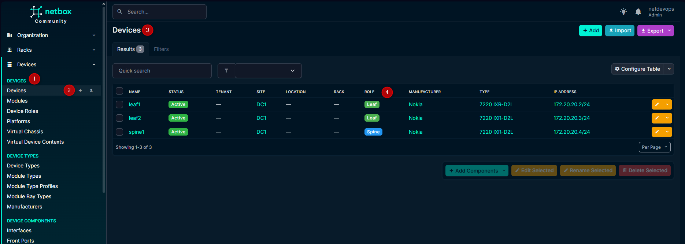
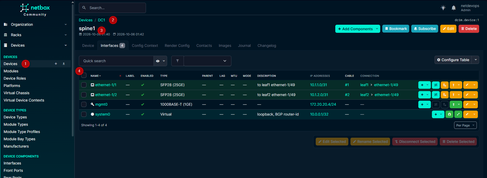
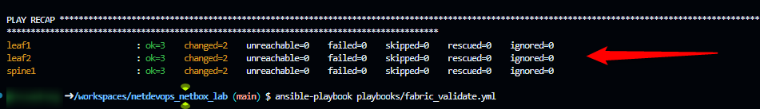
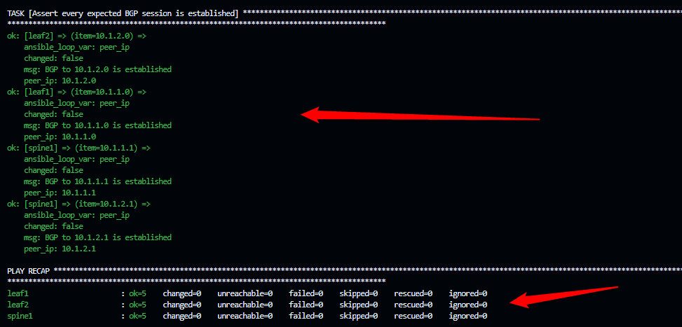
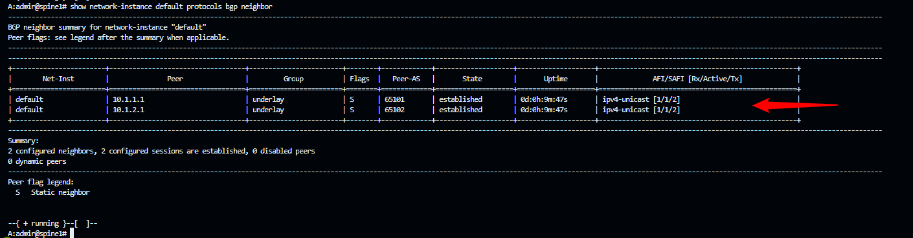
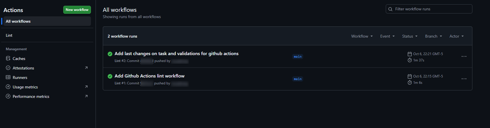

# netdevops_netbox_lab

[](https://github.com/rscuadrosg/netdevops_netbox_lab/actions/workflows/lint.yml)
[](https://codespaces.new/rscuadrosg/netdevops_netbox_lab)

NetDevOps lab where **NetBox is the source of truth** and **Ansible** builds
and validates the network from it: a Nokia SR Linux spine-leaf fabric with an
eBGP underlay, running in **Containerlab** inside **GitHub Codespaces**.
Everything is free and reproducible from this repo.

**What it shows**

- **Source of truth as code**: the network design lives in `data/fabric.yml`
  and is loaded into NetBox by an idempotent playbook.
- **Dynamic inventory**: Ansible asks NetBox which devices exist and how to
  reach them; there is no hand-written host list.
- **Config generated from intent**: per-platform Jinja2 templates turn NetBox
  data into router config, pushed over the SR Linux JSON-RPC API.
- **BGP neighbors derived from cabling**: peers and their ASNs are computed
  from the cables in NetBox, not typed by hand.
- **Validation and drift remediation**: a playbook compares the live BGP
  state with what NetBox says it should be, and re-running the configure
  playbook fixes manual changes.
- **Multi-vendor by design** and **CI** with `yamllint` and `ansible-lint`.

## Architecture

```
                     data/fabric.yml  (intended network, in Git)
                            │  playbooks/netbox_populate.yml
                            ▼
                ┌───────────────────────┐
                │        NetBox         │  devices, interfaces, IPs,
                │   (source of truth)   │  ASNs, cables
                └───────────┬───────────┘
                            │  dynamic inventory (netbox.netbox.nb_inventory)
                            ▼
   templates/srlinux/*.j2 ──► Ansible ──► JSON-RPC ──► Containerlab fabric
                            │                            spine1
                            │                           /      \
                            │                       leaf1      leaf2
                            ▼
              playbooks/fabric_validate.yml  (expected vs actual BGP state)

   GitHub Actions: yamllint + ansible-lint on every push
```

### Fabric

| Device | Role | ASN | Loopback (`system0`) | Management |
|---|---|---|---|---|
| spine1 | Spine | 65100 | 10.0.0.1/32 | 172.20.20.4 |
| leaf1 | Leaf | 65101 | 10.0.0.11/32 | 172.20.20.2 |
| leaf2 | Leaf | 65102 | 10.0.0.12/32 | 172.20.20.3 |

| Link | spine1 side | Leaf side |
|---|---|---|
| spine1 ↔ leaf1 | `ethernet-1/1` 10.1.1.0/31 | `ethernet-1/49` 10.1.1.1/31 |
| spine1 ↔ leaf2 | `ethernet-1/2` 10.1.2.0/31 | `ethernet-1/49` 10.1.2.1/31 |

Each leaf learns the other leaf's loopback through the spine over eBGP.

## Screenshots

**NetBox as the source of truth**: devices with role, model and primary IP.



**Interfaces, IPs and cables of spine1** in NetBox. The cables are what the
BGP template uses to find each neighbor.



**Configure**: routers redeployed with factory config, then configured from
NetBox in one run.



**Validate**: every BGP session expected by NetBox is established.



**On the router**: spine1 with both eBGP neighbors established.



**CI**: lint runs on every push.



## Quickstart

Requires a GitHub account. Codespaces' free monthly quota is enough; stop the
Codespace when you finish.

1. **Open the Codespace**: click the *Open in GitHub Codespaces* badge above
   and pick a 4-core / 16 GB machine. Docker, Containerlab, Ansible and the
   collections install automatically.

2. **Start NetBox** and create an admin user:

   ```bash
   bash scripts/netbox-up.sh
   cd ~/netbox-docker && docker compose exec netbox /opt/netbox/netbox/manage.py createsuperuser
   cd /workspaces/netdevops_netbox_lab
   ```

   Open NetBox from the **Ports** tab (port 8000). The first boot runs
   database migrations and takes a few minutes.

3. **Give Ansible a NetBox API token**: in NetBox, *your user → API Tokens →
   Add* (write enabled). Store only the token value (it starts with `nbt_`)
   as a Codespaces secret named `NETBOX_TOKEN`, or for a quick test:

   ```bash
   export NETBOX_TOKEN=<your-token>
   ```

4. **Deploy the routers**:

   ```bash
   sudo containerlab deploy -t lab.clab.yml
   ```

5. **Load the source of truth, configure and validate**:

   ```bash
   ansible-playbook playbooks/netbox_populate.yml   # data/fabric.yml -> NetBox
   ansible-inventory --graph                        # devices discovered from NetBox
   ansible-playbook playbooks/fabric_configure.yml --check --diff   # dry run
   ansible-playbook playbooks/fabric_configure.yml  # NetBox -> routers
   ansible-playbook playbooks/fabric_validate.yml   # expected vs actual BGP
   ```

### Try a drift

Break the network by hand, watch validation catch it, and let Ansible fix it:

```bash
ssh admin@clab-netdevops-leaf2          # password: NokiaSrl1!
#   enter candidate
#   set / interface ethernet-1/49 admin-state disable
#   commit now
#   quit
ansible-playbook playbooks/fabric_validate.yml    # fails: BGP to leaf2 is down
ansible-playbook playbooks/fabric_configure.yml   # re-applies NetBox intent
ansible-playbook playbooks/fabric_validate.yml    # green again
```

## Design

### Templates hold syntax, data holds values

Templates are written **per platform and feature** (`templates/srlinux/bgp.j2`),
never per device or per site. Values come from data at the scope where they
apply: device data from NetBox, site data from `inventory/group_vars/sites_<slug>.yml`.
Adding a device or changing an IP never touches a template.
See [templates/template_definition.md](templates/template_definition.md) and
[templates/srlinux/srlinux_template.md](templates/srlinux/srlinux_template.md).

### Multi-vendor by design

NetBox holds vendor-neutral data; each device's **platform** decides how to
connect (`inventory/group_vars/platforms_<slug>.yml`), how to apply config
(`playbooks/platforms/<slug>.yml`), how to read state
(`playbooks/platforms/<slug>_validate.yml`) and which templates to render
(`templates/<slug>/`). Template-based vendors (Nokia, Arista, Cisco, Juniper)
and API-managed ones (Meraki, Palo Alto) fit the same layout.
See [docs/multi-vendor.md](docs/multi-vendor.md).

### Validation compares intent with reality

`fabric_validate.yml` builds the **expected** BGP peers from NetBox cabling,
each platform reads the **actual** sessions and normalizes them, and the
playbook fails on any difference. The same check works for any vendor.

## Repository layout

| Path | Purpose |
|---|---|
| `.devcontainer/` | Codespaces environment: Docker, Containerlab, Ansible |
| `.github/workflows/lint.yml` | CI: `yamllint` and `ansible-lint` on every push |
| `data/fabric.yml` | Source of truth as code: site, devices, IPs, ASNs, cables |
| `inventory/netbox.yml` | NetBox dynamic inventory |
| `inventory/group_vars/` | Per-platform connection settings and per-site data |
| `playbooks/netbox_populate.yml` | Loads `data/fabric.yml` into NetBox |
| `playbooks/fabric_configure.yml` | Configures every device, dispatching by platform |
| `playbooks/fabric_validate.yml` | Compares live state with NetBox intent |
| `playbooks/platforms/` | Per-platform apply and validate tasks |
| `templates/` | Per-platform Jinja2 config templates and their docs |
| `lab.clab.yml` | Containerlab topology |
| `scripts/netbox-up.sh` | Starts NetBox with netbox-docker |
| `collections/requirements.yml`, `requirements.txt` | Ansible collections and Python packages |
| `docs/` | Design notes and screenshots |

## Tech stack

| Piece | Tool |
|---|---|
| Source of truth | NetBox 4 (netbox-docker) |
| Automation | Ansible, `netbox.netbox`, `nokia.srlinux`, `ansible.netcommon` |
| Network | Nokia SR Linux in Containerlab |
| Environment | GitHub Codespaces (dev container) |
| CI | GitHub Actions, `yamllint`, `ansible-lint` (production profile) |

## Roadmap

- add sample CIDR to show organization
- add sample region/sites organization to show scale network management
- Second vendor in the lab (Cisco, Juniper, PaloAlto, Meraki etc...) using the
  multi-vendor layout.
- Streaming telemetry with gNMIc, Prometheus and Grafana.
- Terraform for NetBox intent and a hybrid AWS VPC + site-to-site VPN.
